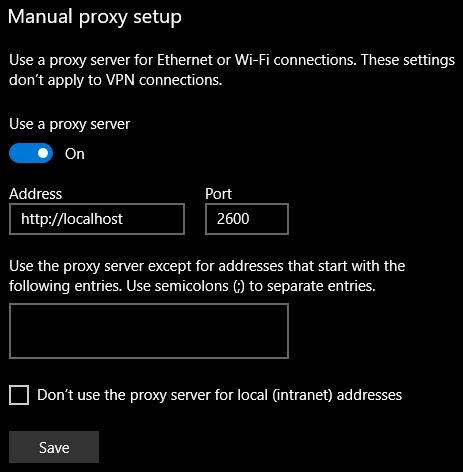
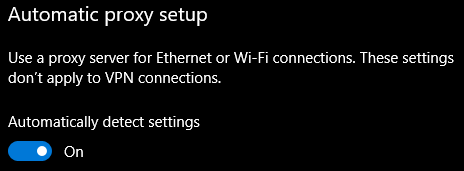
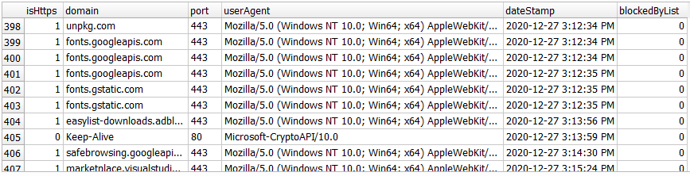

# Web Proxy Filter

Intended to be used as a web proxy for web browsers to block websites. Logs to a SQLite database.

*RUN All these npm commands from the same directory as app.js.*

# Running from Console


Install Packages
```
npm i
```

To start the server, run:
```
npm start
```

Which should run app.js. 

If you had to update Node to run this and you get some "cannot find module" error, try rebuilding dependencies:

```
npm rebuild
```

If you use Windows 10, set the Proxy settings like so:


  


```
Settings > Network & Internet > Proxy
```

You may need to do the following as well (on the same settings page):

  


# What Gets Logged
Schema for this is in the .sql  migration file:

```sql
CREATE TABLE LogEntry (
  isHttps INTEGER,
  domain TEXT,
  port TEXT,
  userAgent TEXT,
  dateStamp TEXT,
  blockedByList INTEGER,
  
  isError INTEGER,
  errorMessage TEXT 
);
```


What it looks like:

  


# Running Tests
Uses [Jest](https://www.npmjs.com/package/jest). Tests not complete yet. So far only methods in utils.

```
npm test
```


# Recommended Tool Kit

- [NSSM](https://nssm.cc/) - Run this proxy app as a Windows service. [Check out repo.](https://github.com/kirillkovalenko/nssm) or [author's personal repo](https://git.nssm.cc/nssm/nssm).
- [Visual Studio Code](https://code.visualstudio.com/) - JavaScript editor used.
- [SQLiteStudio](https://sqlitestudio.pl/) - SQLite editor used.
