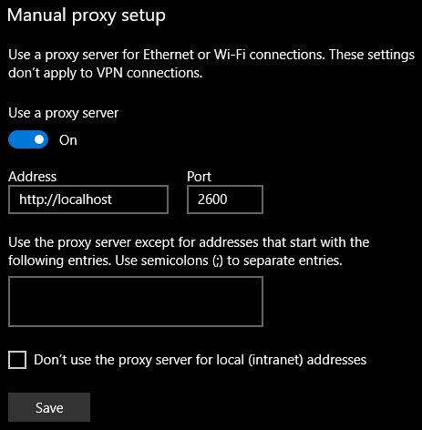
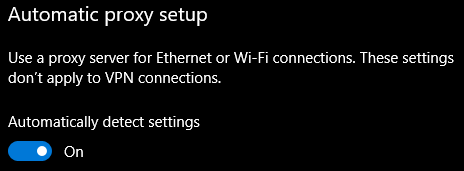
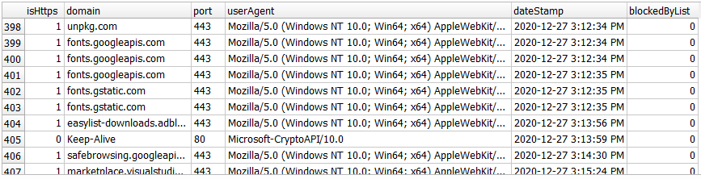

# Web Proxy Filter

Intended to be used as a web proxy for web browsers to block websites. Logs to a SQLite database.


# Running from Console


Install Packages
```
npm i
```

To start the server, run:

```
npm start
```
Which should run app.js. If you use Windows 10, set the Proxy settings like so:


  


```
Settings > Network & Internet > Proxy
```

You may need to do the following as well (on the same settings page):

  


# What Gets Logged
Schema for this is in the .sql  migration file:

```sql
CREATE TABLE LogEntry (
  isHttps INTEGER,
  domain TEXT,
  port TEXT,
  userAgent TEXT,
  dateStamp TEXT,
  blockedByList INTEGER
);
```


What it looks like:

  


# Recommended Tool Kit

- [Visual Studio Code](https://code.visualstudio.com/)
- [SQLiteStudio](https://code.visualstudio.com/)